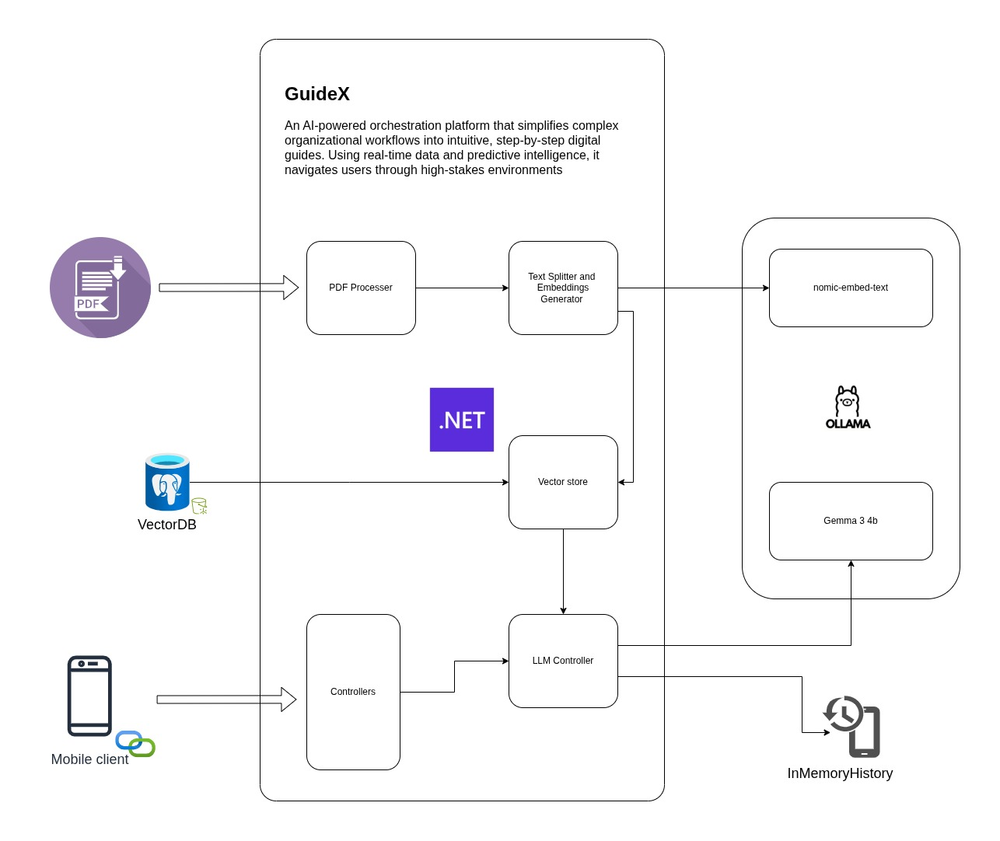

# GuideX Backend



## Prerequisites

- .NET SDK 9.0
- Docker (for Postgres + pgvector)

## Run locally

1. Start the database:

```bash
docker compose up -d
```

2. Restore dependencies:

```bash
dotnet restore
```

3. Run the API:

```bash
dotnet run
```

Swagger UI is available at `/swagger` on the URL printed by `dotnet run`. The
database connection string lives in `appsettings.json` and can be adjusted if
needed.
